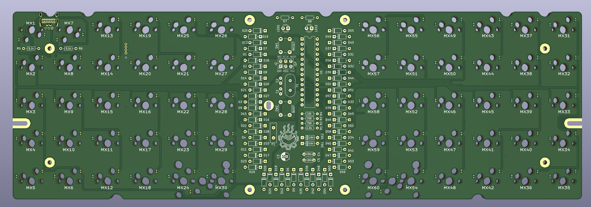
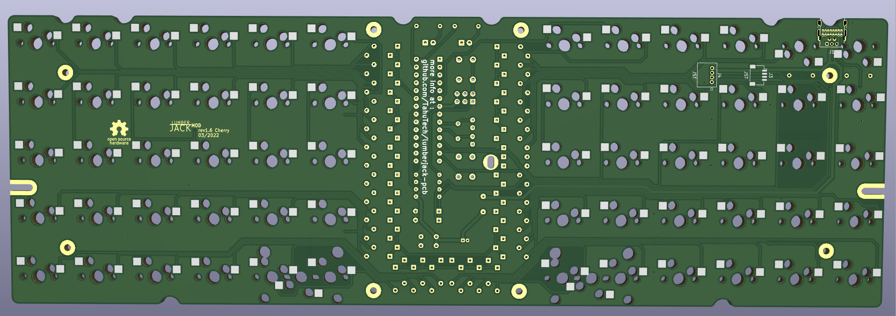
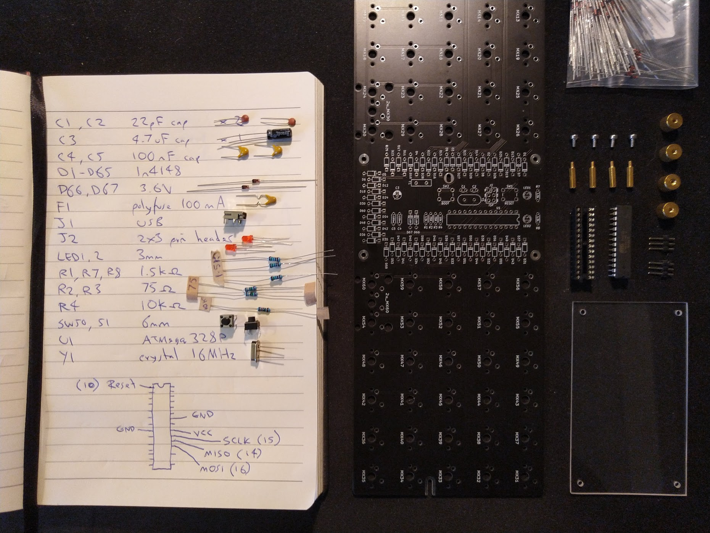

# lumberjack-pcb

this modified lumberjack pcb to hotswap switch (only support cherry switch)
Lumberjack is a split 5x12 ortholinear keyboard PCB using through-hole components only.

Original Repo by peej [Lumberjack keyboard](https://github.com/peej/lumberjack-keyboard).

# Ordering parts

See the [Bill of materials](BOM.md) for a detailed list of the required parts.

PCBs can be manufactuered by a variety of online PCB fabricators

The gerber file is ready to produce

[lumberjack.zip](https://github.com/TahuTech/lumberjack-pcb/tree/main/gerbers) PCB.

chosen the version what you need to print

# Revisions

## Rev 1.6 Mod Cherry

- change to hotswap switch universal ( cherry only )
- support by jaykeebs

## Rev 1.7 Mod Cherry

- change to hotswap switch universal ( cherry only )
- routing now is rounded

## Next Revision

- maybe add design case
